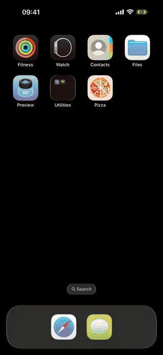

# Pizza Mobile App

Interactive pizza catalog built with SwiftUI. Catalog data, prices, sizes, and high-resolution images are loaded from the [live API](https://oursongapp.com/api/pizzas).

## Demo

<p align="center">
  
</p>

[Watch the full-quality screen recording](Demo/PizzaMobileAppDemo.mp4)

## Features

- Animated eight-frame splash sequence.
- Snapping pizza carousel with animated size selection.
- Live quantity and total-price updates using `Decimal`.
- Tap and pinch-to-zoom ingredient inspection.
- Cache-first startup with background catalog refresh.
- Memory and disk image caching with retry states.
- Accessibility support for Dynamic Type, VoiceOver, and Reduce Motion.

## Technical approach

- Swift 6, SwiftUI, and structured concurrency.
- MVVM with separate Domain, Data, Infrastructure, and Presentation layers.
- Protocol-based dependency injection through the app composition root.
- `URLSession` for REST networking and Kingfisher for image loading.
- Validated DTO-to-domain mapping and explicit loading, error, and degraded startup states.
- Unit coverage for networking, mapping, cache behavior, pricing, view models, image loading, and zoom policy.

## Requirements

- Xcode 16 or newer
- iOS 17.0+

## Run

Open `PizzaMobileApp.xcodeproj`, select the `PizzaMobileApp` scheme, and build the app.

Tests can be run from Xcode or with:

```sh
xcodebuild test \
  -project PizzaMobileApp.xcodeproj \
  -scheme PizzaMobileApp \
  -destination 'platform=iOS Simulator,name=iPhone 16,OS=latest' \
  -parallel-testing-enabled NO \
  CODE_SIGNING_ALLOWED=NO
```

## Third-party software

- Kingfisher 8.9.0 via Swift Package Manager.
- Figtree font under the SIL Open Font License; see `LICENSES/Figtree-OFL.txt`.
